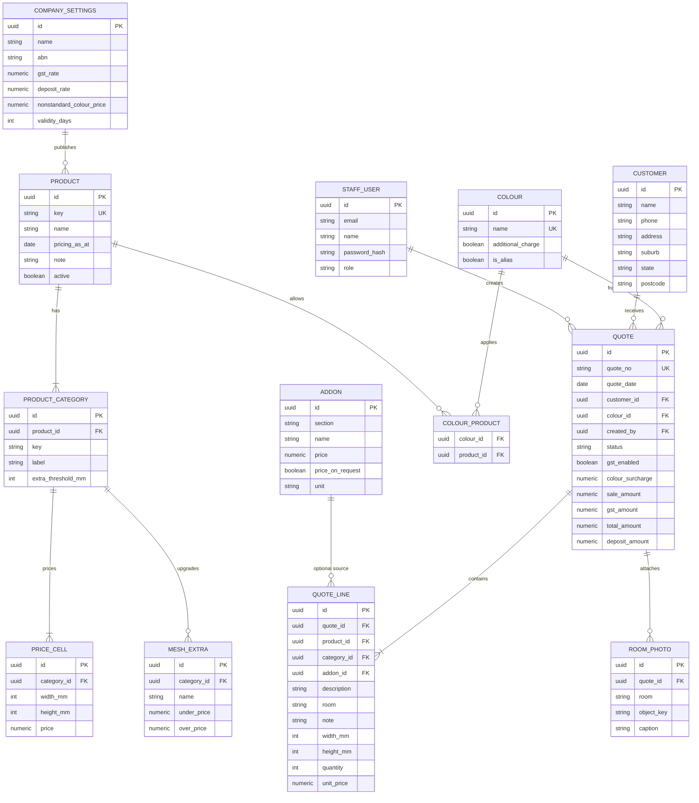

# SmartQuote Pro — Backend API & Database Draft

**Audience:** backend teammate  
**Frontend status:** interactive sketch only (React + TypeScript). Pricing JSON and quotes currently live in the browser.  
**Language / money:** English copy, AUD, GST 10%.  
**This document is a contract, not an implementation.**

The frontend will keep calculating a live quote. The backend owns persistence: customers, price lists, saved quotes, and quote numbers. Do not change field names below without updating the sketch.

---

## 1. Ownership

| Area | Owner | Notes |
|------|--------|--------|
| Quote UI, print layout, client-side price preview | Frontend | Already sketched |
| REST API, auth, Postgres, file storage | Backend | This doc |
| Price-list Excel import | Shared later | Sketch already parses the xlsx in-browser |

Out of scope for v1: customer portal, payments, MYOB/Xero sync, email send.

---

## 2. Conventions

- Base URL: `/api/v1`
- JSON request/response
- Auth: `Authorization: Bearer <token>` (staff user). Sketch can keep using a mock token until auth lands.
- IDs: UUID strings
- Money: `number` with 2 decimal places (store as `NUMERIC(10,2)`)
- Sizes: integer millimetres
- Dates: ISO `YYYY-MM-DD`
- Timestamps: ISO-8601 UTC
- Errors:

```json
{ "error": { "code": "COLOUR_NOT_AVAILABLE", "message": "Stromboli is not a standard colour for Supascreen doors." } }
```

---

## 3. Domain rules the API must honour

These already exist in the sketch (`src/lib/priceLookup.ts`, `src/lib/quoteTotals.ts`).

1. **Round up, never down.** A typed width/height is billed at the smallest matrix bracket `>=` the request. Below the smallest bracket: use the minimum and flag `clampedToMin`.
2. **Above the matrix** → `TOO_LARGE` (no auto price).
3. **`N/A` cell** → `UNAVAILABLE`.
4. **Mesh extras** use a height threshold (`under` vs `over`).
5. **GST** is 10% of sale amount when `gstEnabled` is true.
6. **Non-standard / extra-charge colour** adds **$220.00** to the sale amount *before* GST (matches live Goldco quotes).
7. **Deposit** is **50%** of `totalAmount`.
8. **Saved quotes are snapshots.** Recalculating against a newer price list must not rewrite an issued quote.

---

## 4. Resource map

```
CompanySettings 1 ── * Product 1 ── * ProductCategory 1 ── * PriceCell
ProductCategory 1 ── * MeshExtra
Product * ── * Colour
Addon (flat-rate extras)
Customer 1 ── * Quote 1 ── * QuoteLine
Quote * ── 1 Colour
Quote 1 ── * RoomPhoto
StaffUser (auth only)
```

---

## 5. ER diagram



---

## 6. Tables (Postgres)

Use `timestamptz` `created_at` / `updated_at` on every table. Soft-delete quotes with `status`, not `DELETE`, once a number has been issued.

### 6.1 `staff_users`

| Column | Type | Notes |
|--------|------|--------|
| id | uuid PK | |
| email | citext unique | login |
| name | text | |
| password_hash | text | |
| role | text | `staff` \| `admin` |

### 6.2 `company_settings` (single row)

Seed from the sketch (`src/data/company.ts`): GST `0.10`, deposit `0.50`, non-standard colour `220.00`, validity `30` days, ABN / QBCC / bank / card fee `1.65`.

### 6.3 `customers`

| Column | Type | Notes |
|--------|------|--------|
| id | uuid PK | |
| name | text not null | |
| phone | text | |
| address | text | street line |
| suburb | text | |
| state | text | default `QLD` |
| postcode | text | |

v1 may store a single `address` text field to match the sketch. Split later if needed.

### 6.4 `products` / `product_categories` / `price_cells` / `mesh_extras`

`products.key` matches the sketch: `supascreen`, `intrudaguard`, `7mm-diamond`, `flyscreens`.

`price_cells.price` nullable = spreadsheet `N/A`.

Unique: `(category_id, width_mm, height_mm)`.

`mesh_extras`: one row per upgrade name (`PETMESH`, …). `under_price` / `over_price` follow `height_mm < extra_threshold_mm`.

### 6.5 `colours` / `colour_products`

`colours.name` examples: `White`, `Black`, `Bronze`, `White Birch Gloss (2602057G)`, `Non-standard / Other`.

`additional_charge = true` → add `company_settings.nonstandard_colour_price` on the quote.

`colour_products` is empty for `Non-standard / Other` (allowed for every product, but charged).

### 6.6 `addons`

Flat-rate extras from the price list (top track, lock post, pet door, call-out fee). `price_on_request` lines cannot be added to a quote until a staff price is typed.

### 6.7 `quotes`

| Column | Type | Notes |
|--------|------|--------|
| quote_no | text unique | `00033021` style, monotonic |
| quote_date | date | |
| customer_id | uuid FK | |
| colour_id | uuid FK | frame colour for the whole job |
| created_by | uuid FK | staff |
| status | text | **Version** lock: `draft` \| `issued`. Do **not** store deal outcome here |
| deal_status | text | **Quote family**: `open` \| `abandoned` \| `closed`. Same for every revision of a `quote_no`. Issue ≠ closed |
| gst_enabled | boolean | default true |
| colour_surcharge | numeric(10,2) | snapshot, usually `0` or `220` |
| sale_amount | numeric(10,2) | lines + colour surcharge, ex GST |
| gst_amount | numeric(10,2) | |
| total_amount | numeric(10,2) | |
| deposit_amount | numeric(10,2) | `50%` of total |
| valid_until | date | quote_date + 30 |

**Quote number:** use a `quote_number_seq` (integer, start at `33021`) and `LPAD(nextval, 8, '0')`. Never reuse a number.

### 6.8 `quote_lines`

Store the **sold** description and unit price, not a live join to the matrix.

| Column | Type | Notes |
|--------|------|--------|
| sort_order | int | print order |
| product_id | uuid null | null for addon-only lines |
| category_id | uuid null | window / door / sliding / hinged |
| addon_id | uuid null | |
| description | text | e.g. `2100 x 0925 Supascreen sliding door *Lounge` |
| room | text | Living Room, Bedroom, … |
| note | text | |
| width_mm / height_mm | int null | |
| matched_width_mm / matched_height_mm | int null | bracket actually billed |
| mesh_option | text | |
| quantity | int not null default 1 | |
| unit_price | numeric(10,2) | snapshot |

A powder-coat line may be stored as a real `quote_lines` row **or** only as `quotes.colour_surcharge`. Pick one; the sketch currently uses a computed surcharge, not a cart line. Prefer **persisting both** the surcharge column and a generated description line so reprints match Goldco PDFs.

### 6.9 `room_photos` (phase 2)

Do not store data URLs in Postgres. Upload to object storage; keep `object_key`, `room`, `caption`.

---

## 7. HTTP API

All list endpoints accept `?q=` (search) and return `{ items, total }`.

### 7.1 Catalog (frontend sketch needs these first)

| Method | Path | Purpose |
|--------|------|---------|
| GET | `/products` | Active products + categories + matrices + mesh extras |
| GET | `/products/:key` | One product |
| GET | `/addons` | Flat-rate extras |
| GET | `/colours?productKey=supascreen` | Colours allowed for a product |
| GET | `/company` | Public quote footer (ABN, bank, GST, deposit, colour fee) |
| POST | `/pricing/lookup` | Server-side price check (optional; sketch can keep doing this locally) |

`GET /products` response shape **must match** the sketch so the UI can swap JSON files for this endpoint with little change:

```json
{
  "note": "All prices exclude GST.",
  "products": [
    {
      "key": "supascreen",
      "name": "Supascreen",
      "pricingAsAt": "2026-02-01",
      "note": null,
      "categories": [
        {
          "key": "doors",
          "label": "Doors",
          "widths": [300, 450],
          "heights": [600, 750],
          "prices": [[100, 200], [150, null]],
          "extras": {
            "thresholdMm": 1500,
            "options": [{ "name": "PETMESH", "under": 40, "over": 80 }]
          }
        }
      ]
    }
  ]
}
```

`POST /pricing/lookup`

```json
{
  "productKey": "supascreen",
  "categoryKey": "doors",
  "widthMm": 925,
  "heightMm": 2100,
  "meshOption": "Standard",
  "doubleHung": false
}
```

```json
{
  "ok": true,
  "unitPrice": 1103,
  "matrixPrice": 1103,
  "extras": 0,
  "matchedWidth": 1050,
  "matchedHeight": 2100,
  "clampedToMin": false
}
```

Failure: `{ "ok": false, "reason": "TOO_LARGE" | "UNAVAILABLE" }`.

### 7.2 Customers

| Method | Path |
|--------|------|
| GET | `/customers?q=hope` |
| POST | `/customers` |
| GET | `/customers/:id` |
| PATCH | `/customers/:id` |

Body: `{ "name", "phone", "address", "suburb", "state", "postcode" }`.

### 7.3 Quotes

| Method | Path | Purpose |
|--------|------|---------|
| GET | `/quotes` | Staff list (`dealStatus`, version `status`, `q`, date range) |
| POST | `/quotes` | Create **draft** (allocates `quote_no`). `deal_status` defaults to `open` |
| GET | `/quotes/:id` | Full quote for the print page |
| PATCH | `/quotes/:id` | Update draft while `deal_status = open`; issued / settled quotes may only change `paid` |
| PATCH | `/quotes/:id/deal-status` | Set family deal status `{ "dealStatus": "open" \| "abandoned" \| "closed" }` for **all** versions |
| POST | `/quotes/:id/issue` | Lock snapshot; status → `issued`. Only while `deal_status = open` |
| POST | `/quotes/:id/revise` | Issued **and** open only: copy to version+1 draft |
| POST | `/quotes/:id/void` | Issued → void **this version** (not the same as Abandoned) |
| POST | `/quotes/:id/lines` | Add a line (product or addon) |
| PATCH | `/quotes/:id/lines/:lineId` | Qty / room / note |
| DELETE | `/quotes/:id/lines/:lineId` | Draft only |

`POST /quotes`

```json
{
  "customerId": "uuid",
  "quoteDate": "2026-08-23",
  "frameColour": "White",
  "gstEnabled": true
}
```

`POST /quotes/:id/lines` (product)

```json
{
  "type": "product",
  "productKey": "supascreen",
  "categoryKey": "sliding-doors",
  "widthMm": 925,
  "heightMm": 2100,
  "meshOption": "Standard",
  "quantity": 1,
  "room": "Lounge",
  "note": ""
}
```

Server looks up price, writes snapshot `unitPrice` + `description`. Frontend may send a preview price; **server wins** on save.

`GET /quotes/:id` (frontend print page)

```json
{
  "id": "uuid",
  "quoteNo": "00033021",
  "quoteDate": "2026-08-23",
  "status": "draft",
  "customer": { "name": "Sample Customer", "phone": "0400 000 000", "address": "1 Example St, Miami QLD" },
  "frameColour": "White",
  "gstEnabled": true,
  "lines": [
    {
      "id": "uuid",
      "quantity": 1,
      "description": "2100 x 0925 Supascreen sliding door *Lounge",
      "room": "Lounge",
      "note": "",
      "unitPrice": 1103.00,
      "lineTotal": 1103.00
    }
  ],
  "colourSurcharge": 0,
  "saleAmount": 1103.00,
  "gstAmount": 110.30,
  "totalAmount": 1213.30,
  "depositAmount": 606.65,
  "validUntil": "2026-09-22",
  "company": { "name": "Goldco Security Group Pty Ltd", "abn": "16 617 027 068" }
}
```

Totals on the server:

```
saleAmount    = sum(line.unitPrice * qty) + colourSurcharge
gstAmount     = gstEnabled ? round(saleAmount * 0.10) : 0
totalAmount   = saleAmount + gstAmount
depositAmount = round(totalAmount * 0.50)
```

Use bankers' or half-up cents rounding consistently (`round(x, 2)`). The sketch uses half-up.

### 7.4 Admin catalog writes (admin role, later)

`PUT /products/:key/matrix`, `PUT /colours`, `PUT /addons` — only after Excel import is moved server-side. Until then, seed from `src/data/pricing.json`, `addons.json`, `colours.json`.

---

## 8. Suggested seed order

1. Insert `company_settings`.
2. Import `src/data/pricing.json` → products / categories / cells / mesh extras.
3. Import `src/data/addons.json`.
4. Import `src/data/colours.json` + `colour_products`.
5. Create one staff user for local demo.

---

## 9. Frontend swap plan

| Sketch today | After API |
|--------------|-----------|
| `src/data/pricing.json` | `GET /products` |
| `src/data/addons.json` | `GET /addons` |
| `src/data/colours.json` | `GET /colours` |
| `src/data/company.ts` | `GET /company` |
| `localStorage` quote | `POST/PATCH /quotes` |
| Client-only quote number | Server sequence |

Keep lookup functions on the frontend for instant UI. Re-run the same rules on the server when saving a line so the stored quote is authoritative.

---

## 10. Open questions for the team

1. Are Bill To and Ship To ever different? Sketch copies one customer to both.
2. Same opening, two product options (Supascreen vs Intrudaguard) — one quote with option groups, or two quote numbers (`33012-SS` / `33012-IG`)? Live PDFs use two numbers.
3. Who may void an issued quote?
4. Room photos in v1 or v2?

---

## 11. Files the backend can seed from

- `src/data/pricing.json`
- `src/data/addons.json`
- `src/data/colours.json`
- `src/data/company.ts`
- `documents/Supply & Install (17-5-26).xlsx`
- `documents/Goldco Standard Colour List (Updated Dec-26).xlsx`

Do **not** commit customer quote PDFs. They contain personal data.
