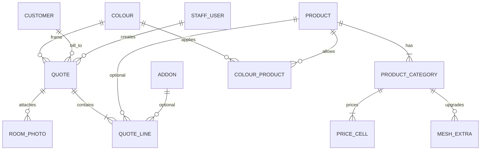

# SmartQuote Pro — 给后端队友的接口 / 库表说明

这份是给队友直接开工用的中文交接。英文原稿在 `docs/backend-api-and-schema.md`，字段名以本文和前端 sketch 为准；不要擅自改 JSON 字段名。

- 前端：React + TypeScript 交互稿，价目和报价目前都在浏览器里
- 后端负责：鉴权、Postgres、报价号、已保存报价、公司资料
- 界面文案英文，货币 AUD，GST 10%
- **这是合同，不是已实现的后端**

v1 不做：客户门户、在线收款、MYOB/Xero、发邮件。

---

## 1. 谁干什么

| 模块 | 谁 | 现状 |
|------|----|------|
| 报价 UI、打印版式、本地算价预览 | 前端 | 已能用 |
| REST、登录、Postgres、对象存储 | 后端 | 待做 |
| 价目 Excel 导入 | 以后一起 | 前端已能在浏览器里解析 xlsx，刷新即丢 |

---

## 2. 约定

- Base URL：`/api/v1`
- JSON；钱用 `number`，库里 `NUMERIC(10,2)`
- ID：UUID 字符串
- 尺寸：整数毫米
- 日期：`YYYY-MM-DD`；时间戳：ISO-8601 UTC
- 鉴权：`Authorization: Bearer <token>`（员工）。前端可先 mock
- 列表：`?q=` 搜索，返回 `{ items, total }`
- 错误：

```json
{ "error": { "code": "COLOUR_NOT_AVAILABLE", "message": "Stromboli is not a standard colour for Supascreen doors." } }
```

---

## 3. 必须遵守的业务规则

对应前端 `src/lib/priceLookup.ts`、`src/lib/quoteTotals.ts`、`src/lib/quoteLifecycle.ts`。

1. **只向上取档，不向下。** 输入宽高按矩阵里最小的 `>=` 档计费。小于最小档：用最小档，并标 `clampedToMin`。
2. **超过最大档** → `TOO_LARGE`，不算价。
3. **单元格 `N/A`**（JSON 里是 `null`）→ `UNAVAILABLE`。
4. **网型加价**按高度阈值分 `under` / `over`。
5. **GST** 在 `gstEnabled` 时为销售额的 10%。
6. **非标颜色**默认加 **$220.00**，加在销售额上、GST 之前。单张报价允许覆盖这个金额。
7. **定金**默认是总额的 **50%**（比例来自公司设置）。
8. **已出单是快照。** 以后改价目表，不能改已经 `issued` 的报价金额。前端已按这个做了：`issued` 后只能改已付金额、开新单、加载别的单。
9. **保存行时以后端算价为准。** 前端可以带预览价，服务端重算后写入快照。

金额：

```
saleAmount    = sum(line.unitPrice * qty) + colourSurcharge
gstAmount     = gstEnabled ? round(saleAmount * 0.10) : 0
totalAmount   = saleAmount + gstAmount
depositAmount = round(totalAmount * depositRate)
balance       = max(0, totalAmount - paid)
```

分用 half-up（`Math.round(x * 100) / 100`），前后端一致。

---

## 4. 表关系

```
StaffUser ──< Quote >── Customer
Quote ──< QuoteLine
Quote ──< RoomPhoto
Quote >── Colour（整单框色）
Quote 可有独立 Ship-To（见 quotes 字段）

Product ──< ProductCategory ──< PriceCell
ProductCategory ──< MeshExtra
Product >──< Colour（colour_products）
Addon（一口价配件）
CompanySettings（单行）
```



每张表都要有 `created_at` / `updated_at`（`timestamptz`）。已发出报价号的单用 `status` 作废，不要物理删。

---

## 5. 表设计（Postgres）

### 5.1 `staff_users`

| 字段 | 类型 | 说明 |
|------|------|------|
| id | uuid PK | |
| email | citext unique | 登录 |
| name | text | |
| password_hash | text | |
| role | text | `staff` \| `admin` |

v1 鉴权可后做；表先留着。

### 5.2 `company_settings`（一行）

从 `src/data/company.ts` 灌进去。前端 Admin 已经能改这些，接口要能读写。

| 字段 | 示例 |
|------|------|
| name | Goldco Security Group Pty Ltd |
| abn | 16 617 027 068 |
| qbcc | 15042108 |
| address | 51 Paradise Ave Miami QLD 4220 |
| phone | (07) 55 722 628 |
| bank_name / bsb / account | Westpac / 034 239 / 405216 |
| card_fee_percent | 1.65 |
| gst_rate | 0.10 |
| deposit_rate | 0.50 |
| nonstandard_colour_price | 220.00 |
| validity_days | 30 |
| warranty_url / care_url | 官网质保、保养链接 |
| terms_note / terms_contract / size_disclaimer / licensing | 页脚条款 |

### 5.3 `customers`

v1 可以只存一个 `address` 文本，对齐前端。`suburb` / `state` / `postcode` 可空，以后再拆。

| 字段 | 说明 |
|------|------|
| id | uuid PK |
| name | 必填 |
| phone | |
| address | 可含换行 |

### 5.4 价目：`products` / `product_categories` / `price_cells` / `mesh_extras`

`products.key` 必须是：`supascreen`、`intrudaguard`、`7mm-diamond`、`flyscreens`。

- `price_cells.price` 可空 = 表里的 N/A
- 唯一：`(category_id, width_mm, height_mm)`
- `mesh_extras`：每种升级一行（如 PETMESH），`under_price` / `over_price` 按 `height_mm < extra_threshold_mm`

**Grille 先不要做。** 源表写了 DO NOT USE FOR PRICING。

### 5.5 `colours` / `colour_products`

- `additional_charge = true` → 报价加非标颜色费
- `Non-standard / Other` 不进 `colour_products`（所有产品都能用，但收费）
- 前端还有自定义颜色名 `customFrameColour`，存在报价上，不必新建颜色行

### 5.6 `addons`

一口价：top track、lock post、pet door、call-out 等。`price_on_request = true` 必须员工先填价格才能入单。

### 5.7 `quotes`

| 字段 | 说明 |
|------|------|
| quote_no | 唯一，形如 `00033021`，单调递增 |
| quote_suffix | 可空，打印成 `00033012-SS` |
| quote_date | date |
| customer_id | Bill To |
| ship_same_as_bill | bool，默认 true |
| ship_name / ship_phone / ship_address | Ship To 不同时用 |
| colour_id | 整单框色 |
| custom_frame_colour | 非标颜色的手填名 |
| colour_extra_override | 可空；有值则覆盖公司默认 $220 |
| created_by | 员工 |
| status | `draft` \| `issued` \| `accepted` \| `void`（前端目前只用 draft / issued） |
| gst_enabled | 默认 true |
| colour_surcharge | 快照，通常 0 或 220 |
| sale_amount / gst_amount / total_amount / deposit_amount | 快照 |
| paid | 已付；issued 后仍可改 |
| valid_until | quote_date + validity_days |
| issued_at | 出单时间 |

报价号：序列 `quote_number_seq` 从 **33021** 起，`LPAD(nextval::text, 8, '0')`。**发出去的号永不复用。**

### 5.8 `quote_lines`

存卖出去的描述和单价，不要每次打印再去连矩阵。

| 字段 | 说明 |
|------|------|
| sort_order | 打印顺序 |
| product_id / category_id / addon_id | 可空；配件行可以没有产品 |
| description | 如 `2100 x 0925 Supascreen sliding door with top track *Lounge` |
| room / note | |
| width_mm / height_mm | 客户输入 |
| matched_width_mm / matched_height_mm | 实际计费档 |
| mesh_option | |
| quantity | 默认 1 |
| unit_price | 快照 |

非标喷粉：`quotes.colour_surcharge` **和** 一行描述（Goldco PDF 是独立一行）。不要只算不存。

### 5.9 `room_photos`（可放 phase 2）

不要把 data URL 塞进 Postgres。传到对象存储，表里只留 `object_key`、`room`、`caption`。

---

## 6. HTTP API

完整路径都在 `/api/v1` 下。

### 6.1 目录（前端最先要）

| 方法 | 路径 | 作用 |
|------|------|------|
| GET | `/products` | 在售产品 + 矩阵 + 网型加价 |
| GET | `/products/:key` | 单个产品 |
| GET | `/addons` | 一口价配件 |
| GET | `/colours?productKey=supascreen` | 该产品可用颜色 |
| GET | `/company` | 页脚：ABN、QBCC、银行、GST、定金、颜色费 |
| PATCH | `/company` | admin 改公司资料 |
| POST | `/pricing/lookup` | 服务端核价（可选；前端本地也会算） |

`GET /products` 形状必须和 `src/data/pricing.json` / `src/types/pricing.ts` 对齐，前端才能把本地 JSON 换成接口：

```json
{
  "note": "All prices exclude GST.",
  "products": [
    {
      "key": "supascreen",
      "name": "Supascreen",
      "pricingAsAt": "2026-02-01",
      "note": null,
      "categories": [
        {
          "key": "doors",
          "label": "Doors",
          "widths": [300, 450],
          "heights": [600, 750],
          "prices": [[100, 200], [150, null]],
          "extras": {
            "thresholdMm": 1500,
            "options": [{ "name": "PETMESH", "under": 40, "over": 80 }]
          }
        }
      ]
    }
  ]
}
```

`POST /pricing/lookup`

请求：`{ "productKey", "categoryKey", "widthMm", "heightMm", "meshOption": "Standard", "doubleHung": false }`

成功：`{ "ok": true, "unitPrice", "matrixPrice", "extras", "matchedWidth", "matchedHeight", "clampedToMin" }`

失败：`{ "ok": false, "reason": "TOO_LARGE" | "UNAVAILABLE" }`

### 6.2 客户

`GET /customers?q=` · `POST /customers` · `GET /customers/:id` · `PATCH /customers/:id`

Body：`{ "name", "phone", "address" }`（suburb/state/postcode 可选）

### 6.3 报价

| 方法 | 路径 | 说明 |
|------|------|------|
| GET | `/quotes` | 员工列表（status、q、日期） |
| POST | `/quotes` | 建 **draft**，同时占号 |
| GET | `/quotes/:id` | 打印页完整数据 |
| PATCH | `/quotes/:id` | 只改 draft；issued 只允许改 `paid` |
| POST | `/quotes/:id/issue` | 锁定快照，status → issued |
| POST | `/quotes/:id/void` | issued → void |
| POST | `/quotes/:id/lines` | 加一行（产品或配件） |
| PATCH | `/quotes/:id/lines/:lineId` | 数量 / 描述 / 单价 / 房间 / 备注（draft） |
| DELETE | `/quotes/:id/lines/:lineId` | 仅 draft |

`POST /quotes`

```json
{
  "customerId": "uuid",
  "quoteDate": "2026-08-23",
  "quoteSuffix": "SS",
  "frameColour": "White",
  "gstEnabled": true,
  "shipSameAsBill": true
}
```

`POST /quotes/:id/lines`（产品）

```json
{
  "type": "product",
  "productKey": "supascreen",
  "categoryKey": "sliding-doors",
  "widthMm": 925,
  "heightMm": 2100,
  "meshOption": "Standard",
  "quantity": 1,
  "room": "Lounge",
  "note": "",
  "fitExtras": ["TOP TRACKS"]
}
```

服务端查价，写入 `unitPrice` + `description`。前端预览价仅供参考。

`GET /quotes/:id` 给打印页（字段名对齐前端）：

```json
{
  "id": "uuid",
  "quoteNo": "00033021",
  "quoteSuffix": "SS",
  "quoteDate": "2026-08-23",
  "status": "draft",
  "customer": { "name": "Sample Customer", "phone": "0400 000 000", "address": "1 Example St\nMiami QLD" },
  "shipSameAsBill": true,
  "shipTo": { "name": "", "phone": "", "address": "" },
  "frameColour": "White",
  "customFrameColour": "",
  "gstEnabled": true,
  "lines": [
    {
      "id": "uuid",
      "quantity": 1,
      "description": "2100 x 0925 Supascreen sliding door *Lounge",
      "room": "Lounge",
      "note": "",
      "unitPrice": 1103.00,
      "lineTotal": 1103.00
    }
  ],
  "colourSurcharge": 0,
  "saleAmount": 1103.00,
  "gstAmount": 110.30,
  "totalAmount": 1213.30,
  "depositAmount": 606.65,
  "paid": 0,
  "balance": 1213.30,
  "validUntil": "2026-09-22",
  "company": {
    "name": "Goldco Security Group Pty Ltd",
    "abn": "16 617 027 068",
    "qbcc": "15042108"
  }
}
```

### 6.4 管理端写目录（admin，可后做）

`PUT /products/:key/matrix`、`PUT /colours`、`PUT /addons` —— 等 Excel 导入搬到服务端再做。现在请从下面 JSON 灌库。

---

## 7. 灌库顺序

1. `company_settings` ← `src/data/company.ts`
2. `src/data/pricing.json` → products / categories / cells / mesh extras
3. `src/data/addons.json`
4. `src/data/colours.json` + colour_products
5. 一个本地员工账号

源 Excel（同一套模板）：

- `documents/Supply & Install (17-5-26).xlsx`
- `documents/Goldco Standard Colour List (Updated Dec-26).xlsx`

**不要提交客户报价 PDF**（含个人信息）。

---

## 8. 前端怎么接

| 现在 | 接上 API 后 |
|------|-------------|
| `src/data/pricing.json` | `GET /products` |
| `src/data/addons.json` | `GET /addons` |
| `src/data/colours.json` | `GET /colours` |
| `src/data/company.ts` + localStorage | `GET/PATCH /company` |
| localStorage 当前单 + Saved 列表 | `POST/PATCH/GET /quotes` |
| 浏览器里自增报价号 | 服务端序列 |

前端会继续本地算价，保证输入时不卡。**入单以后端结果为准。**

---

## 9. 建议实现顺序

1. 建库 + 灌价目 / 颜色 / 配件 / 公司资料
2. `GET /products` `/addons` `/colours` `/company`
3. `POST /pricing/lookup`（和前端 `findPrice` 对一组用例）
4. 客户 + 报价 CRUD、占号、加行、出单
5. 登录（前端 Admin 现在只是导航按钮，还没有鉴权）
6. 照片对象存储

核价自测建议：宽 925 × 高 2100 的 Supascreen sliding door，应落到 1050×2100 档（具体金额以当前 `pricing.json` 为准）。

---

## 10. 已拍板 / 还要一起定

**前端已经做成、请按这个实现：**

- Bill To 和 Ship To 可以不是同一个人
- 报价号可带后缀：`33012-SS`、`33010-DG`
- Paid 可填；Balance = 总额 − 已付；issued 后仍可改 Paid
- 非标颜色费可按单改
- 明细加入后可改描述和单价
- 常用配件（top track、lock post 等）可以写进同一行产品描述
- Price on request 先填价格再加入
- 出单后金额锁定

**还要一起定：**

1. 同一洞口两个产品选项（Supascreen vs Intrudaguard）：一张单里分组，还是两个号（`33012-SS` / `33012-IG`）？现有 PDF 是两个号。
2. 谁可以 void 已出单？
3. 现场照片做不做 v1？
4. `accepted` 状态要不要 v1 就做？

---

## 11. 和英文原稿的差异

`docs/backend-api-and-schema.md` 写得比较早。本文已按当前前端补上：Ship To、quoteSuffix、paid/balance、公司 ABN/QBCC/银行/条款、颜色覆盖价、issued 快照、行内可改描述单价。实现时以本文为准。
